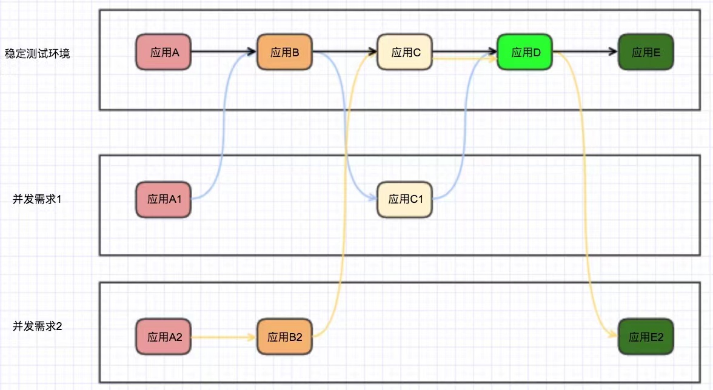

### 1. 背景
微服务之后产生的几个问题?
1) 微服务拆分越来越多,开发人员,需要在本地机器上部署一整套环境,对开发人员机器的配置要求比较高(按最小内存换算512M * 20个进程,就需要10G的内存.)  
2) 新人入职,要去仓库拉取大量的项目在本地部署,而微服务的依赖关系比较复杂,新人可能几天都搭不起一套环境,造成入职当天就离职(人员流失问题). 
3) CI/CD虽然是时刻进行,但是,开发需要等待CI/CD之后,才能进行测试.   
4) 就算是用Docker去部署应用,内存永远是一个避不开的伤.  



### 2. 解决思路
1) 一套稳定环境,上面部署着所有的微服务(俗称:开发稳定环境).   
2) 开发人员只拉取需要维护的工程代码.
3) 开发人员与稳定环境共用一套Eureka(仅拉取,不注册).  
4) 通过指定协议头(x-route:test-provider/127.0.0.1:8080,test-consumer/127.0.0.1:7071),把指定的流量导到开发人员的本
   机上,其余流量,继续复用开发稳定环境的调用链.   

### 3. 集成步骤
> route-service插件的集成很简单,只需要添加依赖,开启配置即可,该插件,对你现在的应用完全无侵入.      

1. 添加依赖
```xml
 <dependency>
      <groupId>help.lixin</groupId>
      <artifactId>route-core</artifactId>
      <version><version>1.0.0</version></version>
  </dependency>
```
2. 开启route插件
```properties
# 开启route重写功能
x-route.enabled=true
```
3. 测试
```
# 请求开发稳定环境的test-consumer微服务的consumer接口(http://localhost:9000/test-consumer/consumer)
# 在默认情况下,请求会进行负载均衡.
# 如果你配置了协议头,同时,微服务名称与协议头中配置的微服务名称相同,则会进行路由的重写(导流到指定的IP和端口上).    
# x-route:test-provider/127.0.0.1:8080,test-consumer/127.0.0.1:7071
$ curl  -H 'x-route:test-provider/127.0.0.1:8080,test-consumer/127.0.0.1:7071' http://localhost:9000/test-consumer/consumer
```
### 4. 项目工程目录介绍
```
lixin-macbook:route-service lixin$ tree -L 2
.
├── README.md
├── docs                      # 文档
│   ├── README.md
│   └── imgs
├── pom.xml
├── route-core               # route核心代码
│   ├── pom.xml
│   ├── src
│   └── target
├── route-examples          # route测试代码
│   ├── pom.xml
│   ├── route-apps-example      # 模拟应用程序
│   ├── route-eureka-example    # eureka-server
│   └── route-gateway-example   # gateway
└── route-model                       # route的业务模型
```
### 5. 相关问题
1) 为什么要共用Eureka?    
   当流量导到你指定的机器上后,余下的的调用链还需要继续执行的话,就需要与开发稳定环境共享同一个Eureka.  
2) 支持路由重写哪些?    
   暂时只支持:Spring Cloud Gateway/Ribbon/OpenFeign. 